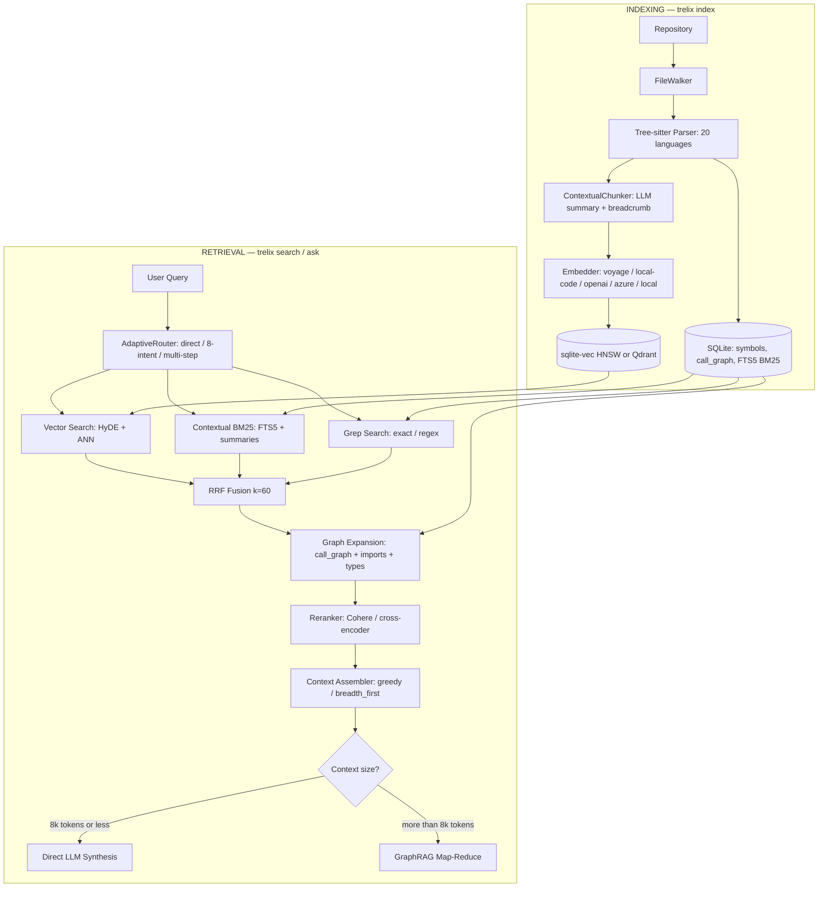

# trelix

[](https://github.com/sairam0424/trelix/actions/workflows/ci.yml)
[](https://pypi.org/project/trelix/)
[](https://pypi.org/project/trelix/)
[](LICENSE)
[](CHANGELOG.md)
[](https://github.com/sairam0424/trelix)
[](https://pypi.org/project/trelix-langchain/)
[](https://pypi.org/project/trelix/)

**Fast, reliable code indexing and retrieval.** Given a user query and a repository, trelix finds the most relevant code — using a 3-tier adaptive query planner, contextual hybrid search (semantic + keyword + grep), call-graph expansion, reranking, and LLM synthesis.

```
trelix index  ./my-repo
trelix ask    ./my-repo "how does authentication work?"
trelix search ./my-repo "JWT validation"
trelix watch  ./my-repo          # real-time incremental indexing
trelix stats  ./my-repo
```

---

## What's New in v0.4.0 — Beast Mode

| Upgrade | What it adds | Impact |
|---------|-------------|--------|
| **Contextual Chunking** | LLM summary prepended to each chunk before embedding + BM25 | 67% retrieval failure reduction |
| **Voyage / local-code Embedder** | `voyage-code-3` or `SFR-Embedding-Code-2B_R` (2B params) | +49% quality vs Ada-002 on CoIR |
| **Filterable HNSW** | O(log n) vector search via sqlite-vec HNSW index | Unblocks 1M+ chunk scale |
| **Qdrant Backend** | Optional drop-in for >500k chunks | Enterprise-scale deployments |
| **Async Pipeline** | 4 concurrent embed batches via asyncio | ~3-4x indexing speedup |
| **File Watcher** | `trelix watch` — auto-reindex on file save | Zero-latency incremental updates |
| **Adaptive Router** | 3-tier: direct / single-step / multi-step decomposition | Smarter routing per query complexity |
| **GraphRAG Synthesis** | Map-reduce for large result sets (>20 results / >8k tokens) | Handles arbitrarily large codebases |
| **Call Graph Precision** | Qualified-name + type-hint resolution | ~40% fewer false-positive edges |
| **Production Eval Harness** | MRR, Recall@1/5/10, NDCG@10 on 50 queries | CI regression gate |

---

## Features

- **Tree-sitter parsing** for 20+ languages — functions, classes, methods, call edges, imports
- **Contextual hybrid search** — contextual embeddings + contextual BM25 + grep via Reciprocal Rank Fusion
- **3-tier adaptive query planner** — direct (skip retrieval) → single-step (8-intent) → multi-step decomposition
- **Call-graph + import expansion** — PageRank-weighted graph traversal with qualified-name precision
- **Reranking** — Cohere or cross-encoder reranker for final precision
- **LLM synthesis** — `trelix ask` with GraphRAG map-reduce for large corpora
- **Zero-infra default** — single SQLite file (`.trelix/index.db`) with sqlite-vec HNSW + FTS5 BM25
- **Real-time watching** — `trelix watch` auto-indexes on every file save
- **Works offline** — `--provider local` uses sentence-transformers, no API key needed

---

## Quick Start

```bash
# Install (local embeddings — no API key needed)
pip install "trelix[local]"

# Index a repository
trelix index ./my-repo

# Search for code (returns a Rich table)
trelix search ./my-repo "database connection pooling"

# Ask a question (requires OPENAI_API_KEY or AZURE_API_KEY)
trelix ask ./my-repo "how does the authentication middleware work?"

# Watch for file changes and auto-reindex
trelix watch ./my-repo

# Show index statistics
trelix stats ./my-repo

# Re-index a single file after editing
trelix update-index ./my-repo src/auth/middleware.py

# Migrate to Qdrant for large-scale deployments
trelix migrate-vectors --to qdrant --url http://localhost:6333
```

### GitHub Actions — index in CI

Add the [trelix-index-action](https://github.com/sairam0424/trelix-index-action) to any workflow to build and cache the index on every push:

```yaml
- uses: actions/checkout@v4
- uses: sairam0424/trelix-index-action@v1
```

The action handles Python setup, caching (keyed to the commit SHA), and exposes the index path as an output so downstream steps can query it directly.

---

## Installation

```bash
# Homebrew (macOS — Apple Silicon)
brew tap sairam0424/trelix
brew install trelix
```

```bash
# Minimal — local embeddings only (no API key)
pip install "trelix[local]"

# With OpenAI embeddings + query planner + synthesis
pip install trelix
export OPENAI_API_KEY=sk-...

# With best-quality code embeddings (Voyage AI)
pip install "trelix[voyage]"
export VOYAGE_API_KEY=...

# With local code-specialized embeddings (2B model, no API key)
pip install "trelix[local-code]"   # requires ~8GB RAM/GPU

# With Cohere reranker (best precision)
pip install "trelix[rerank]"
export COHERE_API_KEY=...

# With Qdrant vector backend (>500k chunk scale)
pip install "trelix[qdrant]"

# With file watcher (real-time incremental indexing)
pip install "trelix[watch]"

# Everything
pip install "trelix[all]"
```

---

## Configuration

All settings via environment variables or a `.env` file in the working directory.

### Embedding Providers

| Variable | Default | Description |
|---|---|---|
| `TRELIX_EMBEDDER_PROVIDER` | `local` | `local` \| `openai` \| `azure` \| `voyage` \| `local-code` |
| `OPENAI_API_KEY` | — | OpenAI API key |
| `OPENAI_MODEL` | `gpt-4o` | Chat model for planner + synthesis |
| `AZURE_API_KEY` | — | Azure OpenAI API key |
| `AZURE_ENDPOINT` | — | Azure OpenAI endpoint URL |
| `VOYAGE_API_KEY` | — | Voyage AI API key (`trelix[voyage]`) |
| `TRELIX_EMBEDDER_VOYAGE_MODEL` | `voyage-code-3` | Voyage model name |
| `COHERE_API_KEY` | — | Cohere reranker API key |

### Contextual Chunking (v0.4.0)

| Variable | Default | Description |
|---|---|---|
| `TRELIX_CHUNKER_CONTEXTUAL` | `false` | Enable LLM context summary per chunk |
| `TRELIX_CHUNKER_CONTEXTUAL_MODEL` | `gpt-4o-mini` | Model for generating summaries |
| `TRELIX_CHUNKER_CONTEXTUAL_MAX_TOKENS` | `100` | Max tokens per context summary |

### Vector Store (v0.4.0)

| Variable | Default | Description |
|---|---|---|
| `TRELIX_STORE_BACKEND` | `sqlite` | `sqlite` \| `qdrant` |
| `TRELIX_STORE_HNSW` | `true` | Enable HNSW index (sqlite backend) |
| `TRELIX_STORE_HNSW_M` | `16` | HNSW M parameter |
| `TRELIX_STORE_HNSW_EF_SEARCH` | `50` | HNSW ef_search at query time |
| `QDRANT_URL` | `http://localhost:6333` | Qdrant server URL |
| `QDRANT_API_KEY` | — | Qdrant API key (cloud) |
| `QDRANT_COLLECTION` | `trelix` | Qdrant collection name |

### Retrieval Tuning

| Variable | Default | Description |
|---|---|---|
| `TRELIX_RETRIEVAL_CONTEXT_TOKEN_BUDGET` | `12000` | Max context tokens sent to LLM |
| `TRELIX_RETRIEVAL_GRAPH_RAG` | `true` | Enable GraphRAG map-reduce synthesis |
| `TRELIX_RETRIEVAL_GRAPH_RAG_THRESHOLD_TOKENS` | `8000` | Token threshold to activate GraphRAG |
| `TRELIX_RETRIEVAL_GRAPH_RAG_THRESHOLD_RESULTS` | `20` | Result count threshold to activate GraphRAG |
| `TRELIX_PARSE_WORKERS` | `4` | Parallel threads for parsing phase |

See `.env.example` for the full reference.

---

## Supported Languages

### Code (Tree-sitter AST)
Python, TypeScript/TSX, JavaScript/JSX, Go, Java, Rust, C, C++, C#, Kotlin, Ruby

### .NET / Razor
Razor Components (`.razor`), Razor MVC Views (`.cshtml`), MSBuild projects (`.csproj`)

### Config (key-path extraction)
JSON/JSONC, TOML, YAML (multi-document)

### Markup
Markdown (heading sections), HTML (custom elements), CSS/SCSS

---

## Embedding Providers

| Provider | Model | Dim | CoIR Score | Notes |
|---|---|---|---|---|
| `local` | all-MiniLM-L6-v2 | 384 | baseline | No API key, CPU |
| `local-code` | SFR-Embedding-Code-2B_R | 4096 | **67.41** | No API key, ~8GB RAM/GPU |
| `openai` | text-embedding-3-large | 3072 | ~45 | Best general-purpose |
| `azure` | text-embedding-3-large | 3072 | ~45 | Azure-hosted OpenAI |
| `voyage` | voyage-code-3 | 1024 | **56.26** | Best API-based code model |

CoIR benchmark scores from [archersama.github.io/coir](https://archersama.github.io/coir/) (ACL 2025).

---

## How it works



### Indexing phases

| Phase | What | Parallelism |
|-------|------|-------------|
| 1 — Parse | Tree-sitter AST traversal per file | ThreadPoolExecutor (parse_workers=4) |
| 2 — Write | Symbol + chunk insertion, parent_id remapping | Sequential (DB consistency) |
| 3 — Embed | Async batch embedding, up to 4 concurrent API calls | `asyncio.gather` + `Semaphore(4)` |
| 4 — Resolve | Cross-file call edges (qualified-name priority), imports, type edges | Sequential |

### Adaptive Query Router (v0.4.0)

| Tier | Trigger | Behavior |
|------|---------|---------|
| 1 — Direct | Simple factual patterns (`what is X`, `define X`) | Skip retrieval, answer from LLM directly |
| 2 — Single-step | Default for most code queries | 8-intent classification → retrieval strategy |
| 3 — Multi-step | Complex multi-part queries (`walk me through...`, `end-to-end flow`) | LLM decomposes into 2-3 sub-queries, merged results |

### 8 retrieval intents (Tier 2)

| Intent | Legs | Graph expansion | Assembly |
|--------|------|-----------------|----------|
| `symbol_lookup` | grep + BM25 + vector | call (depth 1) | greedy |
| `file_overview` | file-direct | none | greedy |
| `feature_flow` | vector + BM25 | call+import (depth 2) | greedy |
| `project_overview` | file-direct | none | greedy |
| `comparison` | all 3 | call+import (depth 1) | greedy |
| `config_lookup` | file-direct + grep | none | greedy |
| `dependency_map` | vector + BM25 | import forward (depth 2) | breadth_first |
| `blast_radius` | grep + vector + BM25 | import reverse (depth 1) | breadth_first |

### Store layout

Single SQLite file (`.trelix/index.db`) — zero external infrastructure by default.

| Table | Purpose |
|-------|---------|
| `files` | Indexed files with SHA-256 hash for incremental updates |
| `symbols` | Extracted symbols with line spans and `context_summary` (v0.4.0) |
| `call_graph` | Directed call edges with `callee_type_hint` for precision (v0.4.0) |
| `imports` | File-level import edges |
| `type_edges` | Inheritance / implements / trait edges |
| `chunks` | Embeddable text (context header + summary + symbol body) |
| `symbols_fts` | FTS5 virtual table for BM25 (indexes context summaries in v0.4.0) |
| `vec_chunks` | sqlite-vec HNSW vector table (or Qdrant in v0.4.0) |

---

## Eval Results

### Recall@5 on mini_repo (10 queries, local provider)

**Provider**: `local` (sentence-transformers `all-MiniLM-L6-v2`, no API key)

| Query | Expected file | Result |
|-------|--------------|--------|
| how does authentication work | auth.py | ✅ PASS |
| user repository get by id | user.py | ✅ PASS |
| hash password function | utils.py | ✅ PASS |
| login method | auth.py | ✅ PASS |
| validate token | auth.py | ✅ PASS |
| User dataclass | user.py | ✅ PASS |
| main entry point | main.py | ✅ PASS |
| delete user | user.py | ✅ PASS |
| verify password | utils.py | ✅ PASS |
| create user | user.py | ✅ PASS |

**Recall@5: 10/10 = 100%**

### Run the full eval harness (v0.4.0)

```bash
# Quick eval (mini_repo, 10 queries)
make eval

# Full eval (trelix-self, 50 queries, MRR + Recall@1/5/10 + NDCG@10)
make eval-full
```

---

## Integrations

trelix works across the AI developer ecosystem:

| Integration | Install | Usage |
|---|---|---|
| **MCP** (Claude Code, Cursor, Windsurf, Continue.dev) | `pip install trelix-mcp` | `claude mcp add trelix -- trelix-mcp` |
| **LangChain** | `pip install trelix-langchain` | `TrelixRetriever(repo_path=".")` |
| **LlamaIndex** | `pip install trelix-llama-index` | `TrelixIndexRetriever(repo_path=".")` |
| **GitHub Action** | `uses: sairam0424/trelix-index-action@v1` | Auto-index on push |
| **Homebrew** (macOS) | `brew tap sairam0424/trelix` | `brew install trelix` |

### MCP Quick Setup

```bash
pip install trelix-mcp
claude mcp add trelix -- trelix-mcp
```

### LangChain Quick Setup

```python
from trelix_langchain import TrelixRetriever
retriever = TrelixRetriever(repo_path="/path/to/repo")
docs = retriever.invoke("how does authentication work?")
```

---

## Development

```bash
git clone https://github.com/sairam0424/trelix
cd trelix
make install-dev
make test        # 860 unit + 39 integration tests
make lint
make eval        # recall eval on mini_repo
make eval-full   # full 50-query MRR/NDCG eval (requires Azure/OpenAI)
make binary      # build dist/trelix standalone binary via PyInstaller
```

See [CONTRIBUTING.md](CONTRIBUTING.md) for the full guide including how to add a new language parser.

---

## License

MIT — see [LICENSE](LICENSE).
