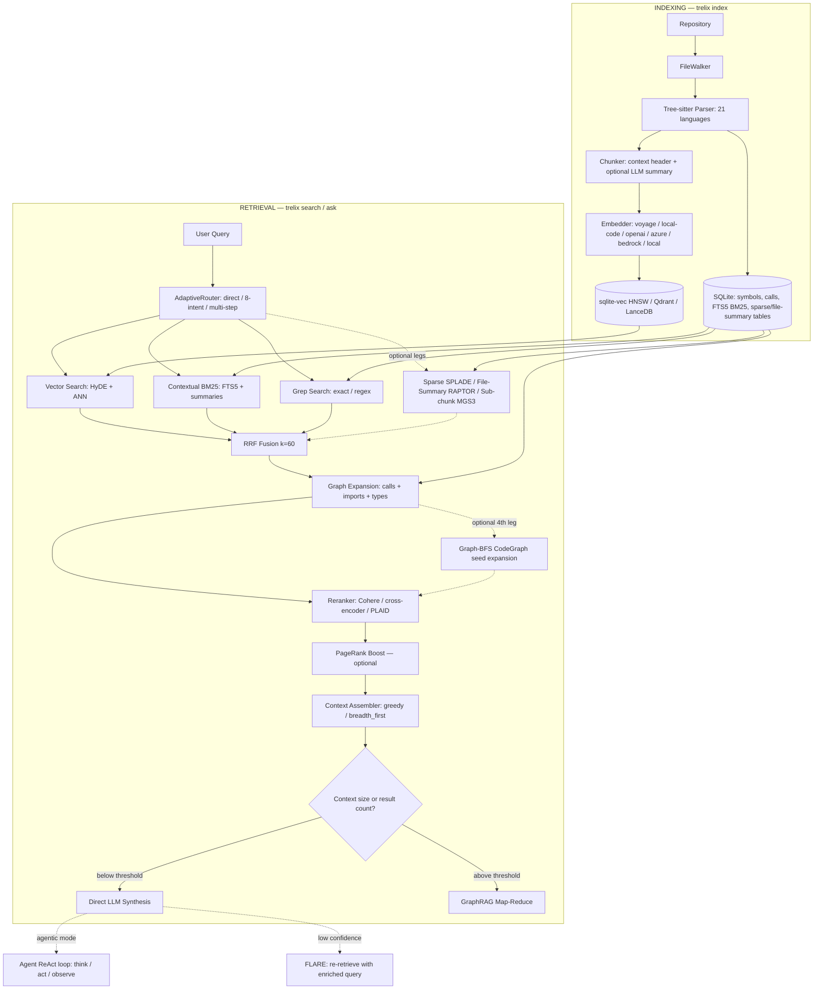

# trelix

[](https://github.com/sairam0424/trelix/actions/workflows/ci.yml)
[](https://pypi.org/project/trelix/)
[](https://python.org)
[](LICENSE)
[](https://github.com/sairam0424/trelix)
[](https://pypi.org/project/trelix-mcp/)
[](https://pypi.org/project/trelix-langchain/)
[](https://pypi.org/project/trelix-llama-index/)
[](https://pypi.org/project/trelix/)
[](https://scorecard.dev/viewer/?uri=github.com/sairam0424/trelix)

<!-- mcp-name: trelix -->

**Code intelligence for your entire codebase — search, ask, review, and watch, locally with zero infra.**

trelix indexes any repository with Tree-sitter, embeds every symbol, and answers natural-language questions using hybrid BM25 + vector + call-graph search. Works offline with no API key. Integrates with Claude Code, Cursor, LangChain, and LlamaIndex in one command.

Why trelix over grep, plain embeddings, or your editor's built-in search? See [docs/WHY_TRELIX.md](docs/WHY_TRELIX.md).

## Documentation

| Goal | Doc |
|------|-----|
| Full documentation index | [docs/README.md](docs/README.md) |
| First time here | [docs/GETTING_STARTED.md](docs/GETTING_STARTED.md) |
| Deep dive on how retrieval/indexing works | [docs/architecture.md](docs/architecture.md) / [docs/USER_GUIDE.md](docs/USER_GUIDE.md) |
| All env vars + `.env` reference | [docs/CONFIGURATION.md](docs/CONFIGURATION.md) |
| Something broken | [docs/TROUBLESHOOTING.md](docs/TROUBLESHOOTING.md) / [docs/FAQ.md](docs/FAQ.md) |
| Upgrading / breaking changes | [docs/BACKWARDS_COMPATIBILITY.md](docs/BACKWARDS_COMPATIBILITY.md) / [docs/ROADMAP.md](docs/ROADMAP.md) |
| Contributing, security, support | [CONTRIBUTING.md](CONTRIBUTING.md) · [SECURITY.md](SECURITY.md) · [SUPPORT.md](SUPPORT.md) |

---

## Contents

[Install](#install) · [MCP Setup](#use-in-claude-code--cursor--windsurf-mcp) · [Quickstart](#30-second-quickstart-cli) · [Features](#features) · [Configuration](#configuration) · [Troubleshooting](#troubleshooting) · [Knowledge Graph](#knowledge-graph) · [How it works](#how-it-works) · [Integrations](#integrations) · [Development](#development)

---

## Install

```bash
pip install "trelix[local]"        # offline — no API key needed
```

```bash
pip install trelix                 # + OpenAI planner & synthesis
export OPENAI_API_KEY=sk-...
```

---

## Use in Claude Code / Cursor / Windsurf (MCP)

```bash
pip install trelix-mcp
claude mcp add trelix -- trelix-mcp   # Claude Code
```

**Cursor** — add to `~/.cursor/mcp.json`:
```json
{
  "mcpServers": {
    "trelix": { "command": "trelix-mcp", "args": [] }
  }
}
```

**Continue.dev** — add to `~/.continue/config.json`:
```json
{ "mcpServers": [{ "name": "trelix", "command": "trelix-mcp" }] }
```

Then in Claude Code / Cursor ask: *"index my repo at /path/to/repo, then find how authentication works"*

---

## Use in Python (LangChain / LlamaIndex)

```bash
pip install trelix-langchain          # LangChain
pip install trelix-llama-index        # LlamaIndex
```

```python
# LangChain
from trelix_langchain import TrelixRetriever
retriever = TrelixRetriever(repo_path="/path/to/repo")
docs = retriever.invoke("how does authentication work?")

# LlamaIndex
from trelix_llama_index import TrelixIndexRetriever
retriever = TrelixIndexRetriever(repo_path="/path/to/repo")
nodes = retriever.retrieve("how does authentication work?")
```

---

## 30-Second Quickstart (CLI)

```bash
pip install "trelix[local]"

# 1. Index your repo (one-time, ~30s for a medium repo)
trelix index ./my-repo

# 2. Search for code
trelix search ./my-repo "JWT validation"

# 3. Ask a question (no API key needed for search)
trelix query ./my-repo "how does the authentication middleware work?"

# 4. Ask with LLM synthesis (needs OPENAI_API_KEY or AZURE_API_KEY)
trelix ask ./my-repo "explain the request lifecycle end-to-end"

# 5. Watch for changes (auto-reindex on save)
trelix watch ./my-repo
```

---

## What trelix does

| Need | Command |
|------|---------|
| Find where a function is defined | `trelix search ./repo "login function"` |
| Understand a feature before editing | `trelix ask ./repo "how does auth work?"` |
| Review a GitHub PR | `trelix review --pr owner/repo#42` |
| Watch all repos simultaneously | `trelix watch-all` |
| Search across multiple repos | `trelix federation add myapp ./myapp` → `trelix search-all "query"` |
| Index stats | `trelix stats ./repo` |
| Call graph for a symbol | `trelix call-graph ./repo AuthService.login` |
| Build a knowledge graph | `trelix graph ./repo` |

**Every query is answered offline by default** — no data leaves your machine. Enable LLM synthesis for natural-language answers.

---

## What's New

**v2.8.1 — Multi-Repo Federation & Persistent Agent Memory:** MCP now exposes multi-repo search (`federation_search_all`) and persistent agent sessions (`ask_agent` with session_id resumption). Security hardening for federation config paths. See [CHANGELOG.md](CHANGELOG.md) for full v2.8.0/v2.8.1 details.

**v2.7.2 — Scale & Concurrency Hardening:** Qdrant Cloud readiness (gRPC + configurable timeout), incremental per-symbol embedding on partial re-index, an opt-in parallel BM25 read pool, Linux ARM64 binaries, and 5 concurrency/correctness fixes.

Full version history: [CHANGELOG.md](CHANGELOG.md).

---

## Features

- **Tree-sitter parsing** for 20+ languages — functions, classes, methods, call edges, imports
- **Contextual hybrid search** — contextual embeddings + contextual BM25 + grep via Reciprocal Rank Fusion
- **3-tier adaptive query planner** — direct (skip retrieval) → single-step (8-intent) → multi-step decomposition
- **Call-graph + import expansion** — PageRank-weighted graph traversal with qualified-name precision
- **Reranking** — Cohere, cross-encoder, or PLAID late-interaction reranker for final precision
- **LLM synthesis** — `trelix ask` streams tokens live; GraphRAG map-reduce for large corpora
- **Universal LLM client** — OpenAI, Azure, Anthropic, Bedrock, Vertex AI, LiteLLM (100+ providers)
- **Zero-infra default** — single SQLite file (`.trelix/index.db`) with sqlite-vec HNSW + FTS5 BM25
- **Real-time watching** — `trelix watch` auto-indexes on every file save
- **Works offline** — `--provider local` uses sentence-transformers, no API key needed
- **BGE-Code-v1 / Nomic CodeRankEmbed** — CoIR SOTA embedding models (`bge-code`, `nomic-code` providers)
- **Matryoshka voyage embeddings** — compact 256/512-dim voyage-code-3 via `TRELIX_EMBEDDER_VOYAGE_OUTPUT_DIMENSIONS`
- **PLAID late-interaction reranker** — 7–45× faster ColBERT via RAGatouille (`rerank_provider=plaid`)
- **Multi-granularity indexing** — LLM file-level summaries alongside symbol chunks (`TRELIX_FILE_SUMMARIES_ENABLED=true`)
- **Streaming synthesis** — `trelix ask` streams tokens live; `GET /ask` SSE endpoint
- **REST API** — `trelix serve ./repo --port 8765` exposes `/search`, `/ask`, `/index`, `/health`
- **LanceDB backend** — 3–5× faster vector insert at 100k+ chunks (`TRELIX_STORE_BACKEND=lance`)
- **Knowledge Graph** — `trelix graph ./repo` builds a Code Property Graph (calls + imports + type hierarchy) as a NetworkX MultiDiGraph; Louvain community detection clusters the codebase into architectural modules; Pyvis interactive HTML visualization; graph-aware BFS as 4th retrieval leg (`TRELIX_RETRIEVAL_GRAPH_SEARCH_ENABLED=true`); `pip install 'trelix[knowledge-graph]'`
- **File-summary 5th retrieval leg** — semantic search over LLM file summaries surfaces high-level architecture answers (`TRELIX_RETRIEVAL_FILE_SUMMARY_LEG=true`)
- **HyDE query expansion** — synthesizes a hypothetical code answer as the ANN query vector, improving recall on abstract questions (`TRELIX_RETRIEVAL_HYDE_FALLBACK=true`)
- **FLARE confidence-gated re-retrieval** — detects low-confidence synthesis spans and re-queries before finalising the answer (`TRELIX_RETRIEVAL_FLARE=true`)
- **PageRank symbol boost** — weights retrieval candidates by graph centrality so hub symbols surface first (`TRELIX_RETRIEVAL_PAGERANK_BOOST=true`)
- **Incremental graph updater** — `trelix watch` automatically patches the Code Property Graph on every file save (no manual `trelix graph` re-run needed)
- **Query telemetry** — per-query latency breakdown, retrieval leg hit rates, and token usage via `trelix telemetry` CLI or `TRELIX_TELEMETRY_ENABLED=true`
- **CoIR eval harness** — `trelix eval ./repo --golden <path>` measures Recall@1/5/10, MRR, and NDCG against a JSONL golden set

---

## More CLI Commands

Beyond the [30-Second Quickstart](#30-second-quickstart-cli) above:

```bash
trelix stats ./my-repo                                              # index statistics
trelix update-index ./my-repo src/auth/middleware.py                # re-index one file after editing
trelix migrate-vectors ./my-repo --to qdrant --url http://localhost:6333  # move to Qdrant at scale
trelix serve ./my-repo --port 8765                                  # start the REST API server
trelix graph ./my-repo --visualize                                  # build knowledge graph + HTML viz
trelix watch-all                                                    # watch all federated repos
trelix review --pr owner/repo#42 --post-comments                   # review + post a GitHub PR
```

### GitHub Actions — index in CI

Add the [trelix-index-action](https://github.com/sairam0424/trelix-index-action) to any workflow to build and cache the index on every push:

```yaml
- uses: actions/checkout@v4
- uses: sairam0424/trelix-index-action@v1
```

The action handles Python setup, caching (keyed to the commit SHA), and exposes the index path as an output so downstream steps can query it directly.

---

## Beast-Mode Activation (v2.1.0)

Enable every retrieval enhancement at once. Copy this block into your `.env` and run the three commands in order.

```bash
# .env — beast-mode flags
TRELIX_RETRIEVAL_GRAPH_SEARCH_ENABLED=true          # 4th leg: graph BFS
TRELIX_RETRIEVAL_FILE_SUMMARY_LEG=true    # 5th leg: file-summary semantic search
TRELIX_RETRIEVAL_HYDE_FALLBACK=true       # HyDE query expansion
TRELIX_RETRIEVAL_FLARE=true               # FLARE confidence-gated re-retrieval
TRELIX_RETRIEVAL_PAGERANK_BOOST=true      # PageRank symbol boost
TRELIX_TELEMETRY_ENABLED=true             # Per-query telemetry
TRELIX_FILE_SUMMARIES_ENABLED=true        # Generate LLM file summaries at index time
```

### Activation order

```bash
# 1. Index — builds chunks, embeddings, and file summaries
trelix index ./my-repo

# 2. Graph — builds Code Property Graph + community detection
#    trelix watch will keep the graph in sync automatically from here
trelix graph ./my-repo
pip install 'trelix[knowledge-graph]'   # if not already installed

# 3. Query — all five retrieval legs active
trelix ask ./my-repo "explain the full request lifecycle"

# 4. Inspect telemetry
trelix telemetry ./my-repo --limit 20

# 5. Measure quality
trelix eval ./my-repo --golden eval/golden.jsonl
```

---

## Troubleshooting

Common issues: sqlite-vec load failures on macOS, Bedrock `ValidationException`s, tree-sitter warning spam, dependency conflicts. Full guide with a diagnostic checklist: [docs/TROUBLESHOOTING.md](docs/TROUBLESHOOTING.md).

---

## Installation

```bash
pip install "trelix[local]"   # minimal, offline, no API key
pip install trelix            # + OpenAI planner & synthesis
pip install "trelix[all]"     # every optional extra (voyage, qdrant, lance, rerank, LLM providers, ...)
```

For every other install path — Voyage/BGE/Bedrock/Vertex/LiteLLM extras, Qdrant/LanceDB backends, standalone binaries, Docker, uv, or upgrading from an older version — see [docs/INSTALLATION_GUIDE.md](docs/INSTALLATION_GUIDE.md).

---

## Configuration

All settings via environment variables or a `.env` file in the working directory.

### LLM Provider (v0.7.0)

Switch chat provider with a single env var — no code changes required.

```bash
# Switch chat provider (one env var)
TRELIX_LLM_PROVIDER=bedrock     # Claude sonnet-4-6 default, haiku fallback
TRELIX_LLM_PROVIDER=azure       # Azure OpenAI (existing .env unchanged)
TRELIX_LLM_PROVIDER=anthropic   # Direct Anthropic API

# Switch embedding provider
TRELIX_EMBEDDER_PROVIDER=bedrock-cohere  # Cohere 1024-dim (best retrieval)
TRELIX_EMBEDDER_PROVIDER=bedrock-titan   # Titan v2 (256/512/1024 dims)
TRELIX_EMBEDDER_PROVIDER=azure           # Azure text-embedding-3-large (default)
```

| Variable | Default | Description |
|---|---|---|
| `TRELIX_LLM_PROVIDER` | `openai` | `openai` \| `azure` \| `anthropic` \| `bedrock` \| `vertex` \| `litellm` |
| `TRELIX_LLM_MODEL` | `gpt-4o` | Chat model override |
| `TRELIX_LLM_BEDROCK_PRIMARY_MODEL` | `us.anthropic.claude-sonnet-4-6` | Bedrock primary model |
| `TRELIX_LLM_BEDROCK_FALLBACK_MODEL` | `us.anthropic.claude-haiku-4-5-20251001-v1:0` | Bedrock fallback on ValidationException |
| `ANTHROPIC_API_KEY` | — | Anthropic API key (`trelix[anthropic]`) |
| `GOOGLE_CLOUD_PROJECT` | — | Google Cloud project (`trelix[vertex]`) |
| `GOOGLE_API_KEY` | — | Google AI Studio API key (`trelix[vertex]`) |
| `AWS_ACCESS_KEY_ID` | — | AWS credentials (`trelix[bedrock]`) |
| `AWS_SECRET_ACCESS_KEY` | — | AWS credentials (`trelix[bedrock]`) |
| `AWS_REGION` | `us-east-1` | AWS region (`trelix[bedrock]`) |

### Embedding Providers

| Variable | Default | Description |
|---|---|---|
| `TRELIX_EMBEDDER_PROVIDER` | `local` | `local` \| `openai` \| `azure` \| `voyage` \| `local-code` \| `bge-code` \| `nomic-code` \| `bedrock-titan` \| `bedrock-cohere` |
| `OPENAI_API_KEY` | — | OpenAI API key |
| `OPENAI_MODEL` | `gpt-4o` | Chat model for planner + synthesis |
| `AZURE_API_KEY` | — | Azure OpenAI API key |
| `AZURE_ENDPOINT` | — | Azure OpenAI endpoint URL |
| `VOYAGE_API_KEY` | — | Voyage AI API key (`trelix[voyage]`) |
| `TRELIX_EMBEDDER_VOYAGE_MODEL` | `voyage-code-3` | Voyage model name |
| `COHERE_API_KEY` | — | Cohere reranker API key |

### Contextual Chunking (v0.4.0)

| Variable | Default | Description |
|---|---|---|
| `TRELIX_CHUNKER_CONTEXTUAL` | `false` | Enable LLM context summary per chunk |
| `TRELIX_CHUNKER_CONTEXTUAL_MODEL` | `gpt-4o-mini` | Model for generating summaries |
| `TRELIX_CHUNKER_CONTEXTUAL_MAX_TOKENS` | `100` | Max tokens per context summary |

### Vector Store (v0.4.0 / v2.0.0)

| Variable | Default | Description |
|---|---|---|
| `TRELIX_STORE_BACKEND` | `sqlite` | `sqlite` \| `qdrant` \| `lance` |
| `TRELIX_STORE_HNSW` | `true` | Enable HNSW index (sqlite backend) |
| `TRELIX_STORE_HNSW_M` | `16` | HNSW M parameter |
| `TRELIX_STORE_HNSW_EF_SEARCH` | `50` | HNSW ef_search at query time |
| `QDRANT_URL` | `http://localhost:6333` | Qdrant server URL |
| `QDRANT_API_KEY` | — | Qdrant API key (cloud) |
| `QDRANT_COLLECTION` | `trelix` | Qdrant collection name |

### Multi-Granularity Indexing (v2.0.0)

| Variable | Default | Description |
|---|---|---|
| `TRELIX_FILE_SUMMARIES_ENABLED` | `false` | Generate LLM file-level summaries alongside symbol chunks (RAPTOR-inspired). Uses the shared `TRELIX_LLM_MODEL` chat client — no separate model override exists. |

### Reranking

| Variable | Default | Description |
|---|---|---|
| `TRELIX_RETRIEVAL_RERANK_PROVIDER` | `cohere` | `cohere` \| `cross_encoder` \| `plaid` \| `xtr` |
| `TRELIX_RETRIEVAL_PLAID_MODEL` | `colbert-ir/colbertv2.0` | RAGatouille PLAID model (`trelix[plaid]`) |

### Retrieval Tuning

| Variable | Default | Description |
|---|---|---|
| `TRELIX_RETRIEVAL_CONTEXT_TOKEN_BUDGET` | `12000` | Max context tokens sent to LLM |
| `TRELIX_RETRIEVAL_GRAPH_RAG` | `true` | Enable GraphRAG map-reduce synthesis |
| `TRELIX_RETRIEVAL_GRAPH_RAG_THRESHOLD_TOKENS` | `8000` | Token threshold to activate GraphRAG |
| `TRELIX_RETRIEVAL_GRAPH_RAG_THRESHOLD_RESULTS` | `20` | Result count threshold to activate GraphRAG |
| `TRELIX_PARSE_WORKERS` | `4` | Parallel threads for parsing phase |

### Beast-Mode Retrieval (v2.1.0)

| Variable | Default | Description |
|---|---|---|
| `TRELIX_RETRIEVAL_FILE_SUMMARY_LEG` | `false` | Enable 5th retrieval leg: ANN search over LLM file summaries |
| `TRELIX_RETRIEVAL_HYDE_FALLBACK` | `false` | Enable HyDE — generate a hypothetical code answer as the ANN query vector |
| `TRELIX_RETRIEVAL_FLARE` | `false` | Enable FLARE — re-retrieve when synthesis confidence falls below threshold |
| `TRELIX_RETRIEVAL_PAGERANK_BOOST` | `false` | Boost retrieval candidates by PageRank graph centrality score |

### Query Telemetry (v2.1.0)

| Variable | Default | Description |
|---|---|---|
| `TRELIX_TELEMETRY_ENABLED` | `false` | Record per-query latency, leg hit rates, and token usage to `.trelix/telemetry.db` |

```bash
# CLI — inspect stored telemetry
trelix telemetry ./my-repo              # last 20 queries
trelix telemetry ./my-repo --limit 100  # last 100 queries
```

See `.env.example` for the full reference.

---

## Supported Languages

### Code (Tree-sitter AST)
Python, TypeScript/TSX, JavaScript/JSX, Go, Java, Rust, C, C++, C#, Kotlin, Ruby

### .NET / Razor
Razor Components (`.razor`), Razor MVC Views (`.cshtml`), MSBuild projects (`.csproj`)

### Config (key-path extraction)
JSON/JSONC, TOML, YAML (multi-document)

### Markup
Markdown (heading sections), HTML (custom elements), CSS/SCSS

---

## Embedding Providers

9 providers, from fully offline (`local`, default) to SOTA-quality (`bge-code`, CoIR 2025) to API-based (`voyage`, `openai`, Bedrock). Full comparison with CoIR benchmark scores, model IDs, and per-provider setup: [docs/PROVIDERS.md](docs/PROVIDERS.md).

> **voyage-code-3 Matryoshka:** Set `TRELIX_EMBEDDER_VOYAGE_OUTPUT_DIMENSIONS=512` for 2× faster HNSW search with minimal quality loss.

---

## Vector Store Backends

| Backend | Best for | Install |
|---------|----------|---------|
| SQLite (default) | Repos up to ~100k chunks | included |
| Qdrant | 500k+ chunks, multi-repo | trelix[qdrant] |
| LanceDB | 100k+ chunks, ARM/Apple Silicon | trelix[lance] |

---

## REST API

```bash
pip install "trelix[serve]"
trelix serve ./my-repo --port 8765
```

| Endpoint | Method | Description |
|----------|--------|-------------|
| `/health` | GET | Health check |
| `/search` | GET | Hybrid code search |
| `/ask` | GET | Streaming synthesis (SSE) |
| `/index` | POST | Index or re-index the repository |
| `/stats` | GET | Index statistics |
| `/graph` | GET | Knowledge graph stats (`node_count`, `edge_count`, `community_count`) — requires `trelix graph` to have run first |
| `/graph/communities` | GET | Louvain community summary list |
| `/graph/visualize` | GET | Export Pyvis HTML visualization, returns file path |
| `/graph/search` | GET | BFS from a symbol (`symbol_id`, `depth` params) |

Full endpoint reference with curl/JSON examples: [docs/USER_GUIDE.md](docs/USER_GUIDE.md).

---

## Knowledge Graph

`trelix graph ./repo` turns your indexed codebase into a traversable Code Property Graph (calls + imports + type hierarchy as a NetworkX MultiDiGraph), with Louvain community detection, Pyvis visualization, and BFS as an optional 4th retrieval leg.

```bash
pip install 'trelix[knowledge-graph]'
trelix graph ./repo --visualize                          # build + export interactive HTML
TRELIX_RETRIEVAL_GRAPH_SEARCH_ENABLED=true trelix ask ./repo "how does auth relate to the data layer?"
```

Full guide (REST endpoints, MCP tools, config vars, community detection internals): [docs/USER_GUIDE.md](docs/USER_GUIDE.md) and [docs/architecture.md §11](docs/architecture.md).

---

## How it works

This is a simplified map of the default path — trelix actually runs up to 7 retrieval legs plus two alternate synthesis modes (agentic ReAct, FLARE). Full pipeline detail: [docs/architecture.md](docs/architecture.md).



### Indexing phases

| Phase | What | Parallelism |
|-------|------|-------------|
| 1 — Parse | Tree-sitter AST traversal per file | ThreadPoolExecutor (parse_workers=4) |
| 2 — Write | Symbol + chunk insertion, parent_id remapping. Content-hash diff skips unchanged symbols (v2.7.2). Optional file-summary + sub-chunk generation. | Sequential (DB consistency) |
| 3 — Embed | Async batch embedding (+ optional sparse SPLADE pass), up to 4 concurrent API calls | `asyncio.gather` + `Semaphore(4)` |
| 4 — Resolve | Cross-file call edges (qualified-name priority), imports, type edges | Sequential |

An alternate streaming pipeline (`TRELIX_INDEXER_STREAMING=true`) replaces phases 1-3 with a bounded producer/consumer queue for very large repos.

### Adaptive Query Router (v0.4.0)

| Tier | Trigger | Behavior |
|------|---------|---------|
| 1 — Direct | Simple factual patterns (`what is X`, `define X`) | Skip vector/BM25/grep/sparse legs — answer from a cheap DB-direct project-overview lookup, no fusion/rerank |
| 2 — Single-step | Default for most code queries | 8-intent classification → retrieval strategy |
| 3 — Multi-step | Complex multi-part queries (`walk me through...`, `end-to-end flow`) | LLM decomposes into 2-3 sub-queries (optionally with multi-query expansion — `TRELIX_RETRIEVAL_MULTI_QUERY=true`), merged results |

### 8 retrieval intents (Tier 2)

| Intent | Legs | Graph expansion | Assembly |
|--------|------|-----------------|----------|
| `symbol_lookup` | grep + BM25 + vector | call (depth 1) | greedy |
| `file_overview` | file-direct | none | greedy |
| `feature_flow` | vector + BM25 | call+import (depth 2) | greedy |
| `project_overview` | file-direct | none | greedy |
| `comparison` | all 3 | call+import (depth 1) | greedy |
| `config_lookup` | file-direct + grep | none | greedy |
| `dependency_map` | vector + BM25 | import forward (depth 2) | breadth_first |
| `blast_radius` | grep + vector + BM25 | import reverse (depth 1) | breadth_first |

Type-edge expansion (max 15) runs unconditionally for every intent above and isn't intent-tuned.

### Store layout

Single SQLite file (`.trelix/index.db`) — zero external infrastructure by default.

| Table | Purpose |
|-------|---------|
| `files` | Indexed files with SHA-256 hash for incremental updates |
| `symbols` | Extracted symbols with line spans, `context_summary`, and `content_hash` (v2.7.2 incremental-embed diff) |
| `calls` | Directed call edges with `callee_type_hint` for precision |
| `imports` | File-level import edges |
| `type_edges` | Inheritance / implements / trait edges |
| `chunks` | Embeddable text (context header + summary + symbol body) |
| `symbols_fts` | FTS5 virtual table for BM25 |
| `chunk_embeddings` | sqlite-vec HNSW vector table (or Qdrant/LanceDB) |
| `sub_chunks`, `file_summaries`, `sparse_embeddings` | Back the optional sub-chunk, file-summary, and sparse retrieval legs above |

4 more tables (`index_metadata` dimension guard, `query_telemetry`, `def_use_edges`, `taint_flows`) are covered in [docs/architecture.md §4](docs/architecture.md#4-storage-layer). `diff_chunks` and the knowledge-graph metadata/concepts tables (written by `trelix graph`) live in the same file but aren't documented there yet.

---

## Eval Results

### Recall@5 on mini_repo (10 queries, local provider)

**Provider**: `local` (sentence-transformers `all-MiniLM-L6-v2`, no API key)

| Query | Expected file | Result |
|-------|--------------|--------|
| how does authentication work | auth.py | PASS |
| user repository get by id | user.py | PASS |
| hash password function | utils.py | PASS |
| login method | auth.py | PASS |
| validate token | auth.py | PASS |
| User dataclass | user.py | PASS |
| main entry point | main.py | PASS |
| delete user | user.py | PASS |
| verify password | utils.py | PASS |
| create user | user.py | PASS |

**Recall@5: 10/10 = 100%**

### Run the full eval harness (v0.4.0 / v2.1.0)

```bash
# Quick eval (mini_repo, 10 queries)
make eval

# Full eval (trelix-self, 50 queries, MRR + Recall@1/5/10 + NDCG@10)
make eval-full

# CoIR eval harness (v2.1.0) — run against your own golden set
# golden.jsonl format: {"query": "...", "expected_file": "path/to/file.py"}
trelix eval ./my-repo --golden eval/golden.jsonl
```

---

## Integrations

trelix works across the AI developer ecosystem:

| Integration | Install | Usage |
|---|---|---|
| **MCP** (Claude Code, Cursor, Windsurf, Continue.dev) | `pip install trelix-mcp` | `claude mcp add trelix -- trelix-mcp` |
| **LangChain** | `pip install trelix-langchain` | `TrelixRetriever(repo_path=".")` |
| **LlamaIndex** | `pip install trelix-llama-index` | `TrelixIndexRetriever(repo_path=".")` |
| **GitHub Action** | `uses: sairam0424/trelix-index-action@v1` | Auto-index on push |
| **VS Code Extension** | `cd workspace-vscode && npm install && npm run build` | `trelix.search` and `trelix.ask` commands via MCP |

### MCP Quick Setup

```bash
pip install trelix-mcp
claude mcp add trelix -- trelix-mcp
```

### LangChain Quick Setup

```python
from trelix_langchain import TrelixRetriever
retriever = TrelixRetriever(repo_path="/path/to/repo")
docs = retriever.invoke("how does authentication work?")
```

---

## Development

```bash
git clone https://github.com/sairam0424/trelix
cd trelix
make install-dev
make test        # full unit + MCP suite
make lint
make eval        # recall eval on mini_repo
make eval-full   # full 50-query MRR/NDCG eval (requires Azure/OpenAI)
make binary      # build dist/trelix standalone binary via PyInstaller
```

See [CONTRIBUTING.md](CONTRIBUTING.md) for the full guide including how to add a new language parser.

---

## License

MIT — see [LICENSE](LICENSE).

**Contributing:** [CONTRIBUTING.md](CONTRIBUTING.md) · **Security:** [SECURITY.md](SECURITY.md) · **Support:** [SUPPORT.md](SUPPORT.md) · **Roadmap:** [docs/ROADMAP.md](docs/ROADMAP.md)
