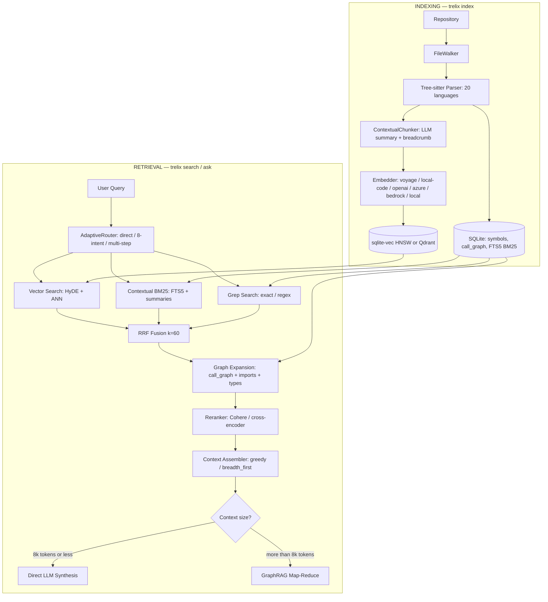

# trelix

[](https://github.com/sairam0424/trelix/actions/workflows/ci.yml)
[](https://pypi.org/project/trelix/)
[](https://python.org)
[](LICENSE)
[](https://github.com/sairam0424/trelix)
[](https://pypi.org/project/trelix-langchain/)
[](https://pypi.org/project/trelix/)
[](https://scorecard.dev/viewer/?uri=github.com/sairam0424/trelix)

<!-- mcp-name: trelix -->

**Code intelligence for your entire codebase — search, ask, review, and watch, locally with zero infra.**

trelix indexes any repository with Tree-sitter, embeds every symbol, and answers natural-language questions using hybrid BM25 + vector + call-graph search. Works offline with no API key. Integrates with Claude Code, Cursor, LangChain, and LlamaIndex in one command.

---

## Install

```bash
pip install "trelix[local]"        # offline — no API key needed
```

```bash
pip install trelix                 # + OpenAI planner & synthesis
export OPENAI_API_KEY=sk-...
```

---

## Use in Claude Code / Cursor / Windsurf (MCP)

```bash
pip install trelix-mcp
claude mcp add trelix -- trelix-mcp   # Claude Code
```

**Cursor** — add to `~/.cursor/mcp.json`:
```json
{
  "mcpServers": {
    "trelix": { "command": "trelix-mcp", "args": [] }
  }
}
```

**Continue.dev** — add to `~/.continue/config.json`:
```json
{ "mcpServers": [{ "name": "trelix", "command": "trelix-mcp" }] }
```

Then in Claude Code / Cursor ask: *"index my repo at /path/to/repo, then find how authentication works"*

---

## Use in Python (LangChain / LlamaIndex)

```bash
pip install trelix-langchain          # LangChain
pip install trelix-llama-index        # LlamaIndex
```

```python
# LangChain
from trelix_langchain import TrelixRetriever
retriever = TrelixRetriever(repo_path="/path/to/repo")
docs = retriever.invoke("how does authentication work?")

# LlamaIndex
from trelix_llama_index import TrelixIndexRetriever
retriever = TrelixIndexRetriever(repo_path="/path/to/repo")
nodes = retriever.retrieve("how does authentication work?")
```

---

## 30-Second Quickstart (CLI)

```bash
pip install "trelix[local]"

# 1. Index your repo (one-time, ~30s for a medium repo)
trelix index ./my-repo

# 2. Search for code
trelix search ./my-repo "JWT validation"

# 3. Ask a question (no API key needed for search)
trelix query ./my-repo "how does the authentication middleware work?"

# 4. Ask with LLM synthesis (needs OPENAI_API_KEY or AZURE_API_KEY)
trelix ask ./my-repo "explain the request lifecycle end-to-end"

# 5. Watch for changes (auto-reindex on save)
trelix watch ./my-repo
```

---

## What trelix does

| Need | Command |
|------|---------|
| Find where a function is defined | `trelix search ./repo "login function"` |
| Understand a feature before editing | `trelix ask ./repo "how does auth work?"` |
| Review a GitHub PR | `trelix review --pr owner/repo#42` |
| Watch all repos simultaneously | `trelix watch-all` |
| Search across multiple repos | `trelix federation add myapp ./myapp` → `trelix search-all "query"` |
| Index stats | `trelix stats ./repo` |
| Call graph for a symbol | `trelix call-graph ./repo AuthService.login` |
| Build a knowledge graph | `trelix graph ./repo` |

**Every query is answered offline by default** — no data leaves your machine. Enable LLM synthesis for natural-language answers.

---

## What's New in v2.5.0

| Plan | Feature | Key API |
|------|---------|---------|
| **A** | Multi-query expansion wired | `TRELIX_RETRIEVAL_MULTI_QUERY=true` |
| **B** | DimensionGuard at watch startup | `DimensionMismatchError` on provider mismatch |
| **C** | MCP resource subscriptions | `subscribe_resource(uri, subscription_id)` |
| **D** | v3.0.0 deprecation audit | `TRELIX_RETRIEVAL_FLARE_MAX_ITER` removed in v3 |

---

## What's New in v2.4.0

| Plan | Feature | Key API |
|------|---------|---------|
| **A** | `flare_max_retries` rename (backward-compat) | `TRELIX_RETRIEVAL_FLARE_MAX_RETRIES` |
| **B** | Multi-query expansion observability | `ExpandResult`, `query_telemetry` columns |
| **C** | FederatedRetriever TTL cache | `FederatedRetriever(cache_ttl=120)` |
| **D** | GitHub PR API integration | `trelix review --pr owner/repo#N` |
| **E** | Multi-repo file watching | `trelix watch-all` |
| **F** | MCP cursor pagination + progress | `search_code(cursor=0)` |

---

## What's New in v2.0.0

| Phase | Upgrade | Impact |
|-------|---------|--------|
| **Embeddings** | BGE-Code-v1 (CoIR SOTA, 81.77 avg) | Best code retrieval quality |
| **Embeddings** | Nomic CodeRankEmbed (no new deps) | Code-specialized, zero extra cost |
| **Embeddings** | Voyage Matryoshka dims (256/512/1024/2048) | 2× faster HNSW, smaller storage |
| **Eval** | LLM-as-judge scorer (0.0–1.0) | Semantic quality measurement |
| **Retrieval** | RAPTOR-style file summaries | "Explain this codebase" queries work |
| **Retrieval** | PLAID reranker (7–45× faster ColBERT) | Production-speed late interaction |
| **Synthesis** | Streaming synthesis | Live token output, no 10s wait |
| **Storage** | LanceDB backend (3–5× faster at 100k+ chunks) | Large-scale deployments |
| **Platform** | REST API + SSE streaming | Remote deployments, web integrations |
| **Knowledge Graph** | Unified code property graph, Louvain community detection, Pyvis visualization, BFS 4th retrieval leg | Architecture understanding queries work |

---

## What's New

### v2.7.2 — Scale & Concurrency Hardening

| Phase | Feature | Activation | Key API |
|-------|---------|------------|---------|
| **Store** | Qdrant Cloud readiness — gRPC transport + configurable client timeout | `QDRANT_PREFER_GRPC=true`, `QDRANT_TIMEOUT=30.0` | `QdrantVectorStore(prefer_grpc=..., timeout=...)`, `query_points()` |
| **Indexing** | Incremental per-symbol embedding — unchanged symbols skip re-embed on partial re-index | auto (content-hash diff, no config needed) | `content_hash` column, `Indexer._insert_one()` |
| **Retrieval** | Parallel BM25 read pool — dedicated read-only connections for concurrent FTS5 reads | `TRELIX_STORE_BM25_READ_POOL_SIZE=4` (default `0`, opt-in) | `ReadOnlyConnectionPool`, `Database.enable_bm25_read_pool()` |
| **Distribution** | Linux ARM64 standalone binary | download `trelix-linux-arm64` from GitHub Releases | `make binary` (PyInstaller) |
| **Reliability** | Concurrency-safety hardening across vector/BM25/grep/sparse retrieval legs | auto (internal, no user action needed) | `Database._conn_lock` |

### v2.7.0 — Agentic Integration & Streaming

| Phase | Feature | Activation | Key API |
|-------|---------|------------|---------|
| **Phase 1** | MCP watch bridge | auto (wired into FileWatcher) | `notify_file_changed()` |
| **Phase 1** | DB index on `files.rel_path` | auto | `idx_files_rel_path` |
| **Phase 1** | AdaptiveRouter retriever config | auto | `AdaptiveRouter(retriever_config=...)` |
| **Phase 2** | Cross-repo symbol resolution | `TRELIX_FEDERATION_RESOLUTION=true` | `make_scip_symbol_id()`, `resolve_symbol()` |
| **Phase 2** | Semantic diff embeddings | `TRELIX_DIFF_EMBEDDINGS=true` | `DiffEmbedder`, `diff_chunks` table |
| **Phase 2** | Streaming indexing | `TRELIX_INDEXER_STREAMING=true` | `_iter_files()`, bounded Queue |
| **Phase 3** | VS Code extension | `pip install trelix[vscode]` | `trelix.search`, `trelix.ask` via MCP stdio |
| **Phase 3** | GitHub App PR review | auto (`.github/workflows/trelix-review.yml`) | Check annotations, auto-comments |

### v2.2.0 — Intelligence Upgrades

| Feature | Enable | What it does |
|---------|--------|--------------|
| Agentic ReAct loop | `TRELIX_RETRIEVAL_AGENTIC=true` | Multi-turn retrieve→observe→re-retrieve with self-correction |
| Data-flow analysis | `TRELIX_PARSER_DATAFLOW=true` | Def-use chains per function via tree-sitter AST walk |
| Taint analysis | `pip install trelix[taint]` then `trelix taint .` | Semgrep source→sink flow detection |
| Sparse+dense hybrid | `TRELIX_RETRIEVAL_SPARSE=true` | SPLADE-Code 6th RRF leg alongside BM25 |
| Multi-granularity | `TRELIX_CHUNKER_MULTI_GRANULARITY=true` | Block+statement level indexing as 7th RRF leg |

### v2.1.0 — Beast-Mode Retrieval

| Category | Upgrade | Activation |
|----------|---------|------------|
| **Retrieval** | File-summary 5th retrieval leg | `TRELIX_RETRIEVAL_FILE_SUMMARY_LEG=true` |
| **Retrieval** | HyDE query expansion | `TRELIX_RETRIEVAL_HYDE_FALLBACK=true` |
| **Retrieval** | FLARE confidence-gated re-retrieval | `TRELIX_RETRIEVAL_FLARE=true` |
| **Retrieval** | PageRank symbol boost | `TRELIX_RETRIEVAL_PAGERANK_BOOST=true` |
| **Observability** | Query telemetry | `TRELIX_TELEMETRY_ENABLED=true` |
| **Eval** | CoIR eval harness | `trelix eval --golden <file>` |

---

## Features

- **Tree-sitter parsing** for 20+ languages — functions, classes, methods, call edges, imports
- **Contextual hybrid search** — contextual embeddings + contextual BM25 + grep via Reciprocal Rank Fusion
- **3-tier adaptive query planner** — direct (skip retrieval) → single-step (8-intent) → multi-step decomposition
- **Call-graph + import expansion** — PageRank-weighted graph traversal with qualified-name precision
- **Reranking** — Cohere, cross-encoder, or PLAID late-interaction reranker for final precision
- **LLM synthesis** — `trelix ask` streams tokens live; GraphRAG map-reduce for large corpora
- **Universal LLM client** — OpenAI, Azure, Anthropic, Bedrock, Vertex AI, LiteLLM (100+ providers)
- **Zero-infra default** — single SQLite file (`.trelix/index.db`) with sqlite-vec HNSW + FTS5 BM25
- **Real-time watching** — `trelix watch` auto-indexes on every file save
- **Works offline** — `--provider local` uses sentence-transformers, no API key needed
- **BGE-Code-v1 / Nomic CodeRankEmbed** — CoIR SOTA embedding models (`bge-code`, `nomic-code` providers)
- **Matryoshka voyage embeddings** — compact 256/512-dim voyage-code-3 via `TRELIX_EMBEDDER_VOYAGE_OUTPUT_DIMENSIONS`
- **PLAID late-interaction reranker** — 7–45× faster ColBERT via RAGatouille (`rerank_provider=plaid`)
- **Multi-granularity indexing** — LLM file-level summaries alongside symbol chunks (`TRELIX_FILE_SUMMARIES_ENABLED=true`)
- **Streaming synthesis** — `trelix ask` streams tokens live; `GET /ask` SSE endpoint
- **REST API** — `trelix serve ./repo --port 8765` exposes `/search`, `/ask`, `/index`, `/health`
- **LanceDB backend** — 3–5× faster vector insert at 100k+ chunks (`TRELIX_STORE_BACKEND=lance`)
- **Knowledge Graph** — `trelix graph ./repo` builds a Code Property Graph (calls + imports + type hierarchy) as a NetworkX MultiDiGraph; Louvain community detection clusters the codebase into architectural modules; Pyvis interactive HTML visualization; graph-aware BFS as 4th retrieval leg (`TRELIX_GRAPH_SEARCH_ENABLED=true`); `pip install 'trelix[knowledge-graph]'`
- **File-summary 5th retrieval leg** — semantic search over LLM file summaries surfaces high-level architecture answers (`TRELIX_RETRIEVAL_FILE_SUMMARY_LEG=true`)
- **HyDE query expansion** — synthesizes a hypothetical code answer as the ANN query vector, improving recall on abstract questions (`TRELIX_RETRIEVAL_HYDE_FALLBACK=true`)
- **FLARE confidence-gated re-retrieval** — detects low-confidence synthesis spans and re-queries before finalising the answer (`TRELIX_RETRIEVAL_FLARE=true`)
- **PageRank symbol boost** — weights retrieval candidates by graph centrality so hub symbols surface first (`TRELIX_RETRIEVAL_PAGERANK_BOOST=true`)
- **Incremental graph updater** — `trelix watch` automatically patches the Code Property Graph on every file save (no manual `trelix graph` re-run needed)
- **Query telemetry** — per-query latency breakdown, retrieval leg hit rates, and token usage via `trelix telemetry` CLI or `TRELIX_TELEMETRY_ENABLED=true`
- **CoIR eval harness** — `trelix eval ./repo --golden <path>` measures Recall@1/5/10, MRR, and NDCG against a JSONL golden set

---

## Quick Start

```bash
# Install (local embeddings — no API key needed)
pip install "trelix[local]"

# Index a repository
trelix index ./my-repo

# Search for code (returns a Rich table)
trelix search ./my-repo "database connection pooling"

# Ask a question (requires OPENAI_API_KEY or AZURE_API_KEY)
trelix ask ./my-repo "how does the authentication middleware work?"

# Watch for file changes and auto-reindex
trelix watch ./my-repo

# Show index statistics
trelix stats ./my-repo

# Re-index a single file after editing
trelix update-index ./my-repo src/auth/middleware.py

# Migrate to Qdrant for large-scale deployments
trelix migrate-vectors --to qdrant --url http://localhost:6333

# Start REST API server
trelix serve ./my-repo --port 8765

# Use PLAID reranker (faster ColBERT)
TRELIX_RETRIEVAL_RERANK_PROVIDER=plaid trelix ask ./my-repo "how does auth work?"

# Enable file-level summaries (RAPTOR-style)
TRELIX_FILE_SUMMARIES_ENABLED=true trelix index ./my-repo

# Use LanceDB for large repos (100k+ chunks)
TRELIX_STORE_BACKEND=lance trelix index ./my-repo

# Build knowledge graph (requires trelix[knowledge-graph])
trelix graph ./my-repo

# With interactive visualization
trelix graph ./my-repo --visualize

# Enable graph as 4th search leg
TRELIX_GRAPH_SEARCH_ENABLED=true trelix ask ./my-repo "explain the auth architecture"

# Watch all federated repos simultaneously
trelix watch-all

# Review a GitHub PR diff
trelix review --pr owner/repo#42

# Post review findings back to GitHub
trelix review --pr owner/repo#42 --post-comments
```

### GitHub Actions — index in CI

Add the [trelix-index-action](https://github.com/sairam0424/trelix-index-action) to any workflow to build and cache the index on every push:

```yaml
- uses: actions/checkout@v4
- uses: sairam0424/trelix-index-action@v1
```

The action handles Python setup, caching (keyed to the commit SHA), and exposes the index path as an output so downstream steps can query it directly.

---

## Beast-Mode Activation (v2.1.0)

Enable every retrieval enhancement at once. Copy this block into your `.env` and run the three commands in order.

```bash
# .env — beast-mode flags
TRELIX_GRAPH_SEARCH_ENABLED=true          # 4th leg: graph BFS
TRELIX_RETRIEVAL_FILE_SUMMARY_LEG=true    # 5th leg: file-summary semantic search
TRELIX_RETRIEVAL_HYDE_FALLBACK=true       # HyDE query expansion
TRELIX_RETRIEVAL_FLARE=true               # FLARE confidence-gated re-retrieval
TRELIX_RETRIEVAL_PAGERANK_BOOST=true      # PageRank symbol boost
TRELIX_TELEMETRY_ENABLED=true             # Per-query telemetry
TRELIX_FILE_SUMMARIES_ENABLED=true        # Generate LLM file summaries at index time
```

### Activation order

```bash
# 1. Index — builds chunks, embeddings, and file summaries
trelix index ./my-repo

# 2. Graph — builds Code Property Graph + community detection
#    trelix watch will keep the graph in sync automatically from here
trelix graph ./my-repo
pip install 'trelix[knowledge-graph]'   # if not already installed

# 3. Query — all five retrieval legs active
trelix ask ./my-repo "explain the full request lifecycle"

# 4. Inspect telemetry
trelix telemetry ./my-repo --limit 20

# 5. Measure quality
trelix eval ./my-repo --golden eval/golden.jsonl
```

---

## Troubleshooting

### sqlite-vec not loading (macOS)
```
ImportError: sqlite-vec requires SQLite ≥ 3.45 with loadable extensions
```
macOS ships with an old SQLite that disables loadable extensions. Fix:
```bash
brew install sqlite
# Then reinstall trelix against the Homebrew SQLite:
LDFLAGS="-L/opt/homebrew/opt/sqlite/lib" pip install --force-reinstall trelix[local]
```

### Bedrock: ValidationException on inference profile
```
ValidationException: Invocation of model ID anthropic.claude-sonnet-4-6 with on-demand throughput isn't supported
```
Bedrock requires **inference profile IDs** (us.* prefix), not bare model IDs:
```bash
TRELIX_LLM_BEDROCK_PRIMARY_MODEL=us.anthropic.claude-sonnet-4-6
TRELIX_LLM_BEDROCK_FALLBACK_MODEL=us.anthropic.claude-haiku-4-5-20251001-v1:0
```

### Bedrock Cohere embeddings: ValidationException on large chunks
```
ValidationException: expected maxLength: 2048
```
Bedrock's Cohere endpoint rejects texts >2048 characters before truncation occurs. trelix pre-truncates automatically since v0.7.1. If you see this on v0.7.0, upgrade:
```bash
pip install --upgrade trelix[bedrock]
```

### tree-sitter FutureWarning spam
Language deprecation warnings from tree-sitter 0.21.x are not yet suppressed automatically. Suppress them with:
```bash
PYTHONWARNINGS=ignore::FutureWarning trelix index .
```

### HuggingFace token warning on local embedder
The local embedder uses sentence-transformers which checks for HF_TOKEN. This is harmless — models are cached locally after first download. Suppress with:
```bash
HF_HUB_DISABLE_SYMLINKS_WARNING=1 trelix index .
```

---

## Installation

```bash
# Homebrew (macOS — Apple Silicon)
brew tap sairam0424/trelix
brew install trelix
```

```bash
# Minimal — local embeddings only (no API key)
pip install "trelix[local]"

# With OpenAI embeddings + query planner + synthesis
pip install trelix
export OPENAI_API_KEY=sk-...

# With best-quality code embeddings (Voyage AI)
pip install "trelix[voyage]"
export VOYAGE_API_KEY=...

# With local code-specialized embeddings (2B model, no API key)
pip install "trelix[local-code]"   # requires ~8GB RAM/GPU

# With BGE-Code-v1 embeddings (CoIR SOTA 2025)
pip install "trelix[bge-code]"

# With Cohere reranker (best precision)
pip install "trelix[rerank]"
export COHERE_API_KEY=...

# With PLAID ColBERT late-interaction reranker
pip install "trelix[plaid]"

# With LanceDB vector backend (3-5x faster insert at 100k+ chunks)
pip install "trelix[lance]"

# With Qdrant vector backend (>500k chunk scale)
pip install "trelix[qdrant]"

# With REST API server
pip install "trelix[serve]"

# With file watcher (real-time incremental indexing)
pip install "trelix[watch]"

# With knowledge graph (NetworkX + Pyvis visualization + community detection)
pip install "trelix[knowledge-graph]"

# LLM provider extras (v0.7.0)
pip install trelix               # OpenAI + Azure (default)
pip install "trelix[bedrock]"    # + AWS Bedrock (chat + embeddings)
pip install "trelix[anthropic]"  # + Anthropic direct
pip install "trelix[vertex]"     # + Google Vertex AI / Gemini
pip install "trelix[litellm]"    # + LiteLLM (100+ providers)
pip install "trelix[llm-all]"    # all LLM providers

# Everything
pip install "trelix[all]"
```

---

## Configuration

All settings via environment variables or a `.env` file in the working directory.

### LLM Provider (v0.7.0)

Switch chat provider with a single env var — no code changes required.

```bash
# Switch chat provider (one env var)
TRELIX_LLM_PROVIDER=bedrock     # Claude sonnet-4-6 default, haiku fallback
TRELIX_LLM_PROVIDER=azure       # Azure OpenAI (existing .env unchanged)
TRELIX_LLM_PROVIDER=anthropic   # Direct Anthropic API

# Switch embedding provider
TRELIX_EMBEDDER_PROVIDER=bedrock-cohere  # Cohere 1024-dim (best retrieval)
TRELIX_EMBEDDER_PROVIDER=bedrock-titan   # Titan v2 (256/512/1024 dims)
TRELIX_EMBEDDER_PROVIDER=azure           # Azure text-embedding-3-large (default)
```

| Variable | Default | Description |
|---|---|---|
| `TRELIX_LLM_PROVIDER` | `openai` | `openai` \| `azure` \| `anthropic` \| `bedrock` \| `vertex` \| `litellm` |
| `TRELIX_LLM_MODEL` | `gpt-4o` | Chat model override |
| `TRELIX_LLM_BEDROCK_PRIMARY_MODEL` | `us.anthropic.claude-sonnet-4-6` | Bedrock primary model |
| `TRELIX_LLM_BEDROCK_FALLBACK_MODEL` | `us.anthropic.claude-haiku-4-5-20251001-v1:0` | Bedrock fallback on ValidationException |
| `ANTHROPIC_API_KEY` | — | Anthropic API key (`trelix[anthropic]`) |
| `GOOGLE_CLOUD_PROJECT` | — | Google Cloud project (`trelix[vertex]`) |
| `GOOGLE_API_KEY` | — | Google AI Studio API key (`trelix[vertex]`) |
| `AWS_ACCESS_KEY_ID` | — | AWS credentials (`trelix[bedrock]`) |
| `AWS_SECRET_ACCESS_KEY` | — | AWS credentials (`trelix[bedrock]`) |
| `AWS_REGION` | `us-east-1` | AWS region (`trelix[bedrock]`) |

### Embedding Providers

| Variable | Default | Description |
|---|---|---|
| `TRELIX_EMBEDDER_PROVIDER` | `local` | `local` \| `openai` \| `azure` \| `voyage` \| `local-code` \| `bge-code` \| `nomic-code` \| `bedrock-titan` \| `bedrock-cohere` |
| `OPENAI_API_KEY` | — | OpenAI API key |
| `OPENAI_MODEL` | `gpt-4o` | Chat model for planner + synthesis |
| `AZURE_API_KEY` | — | Azure OpenAI API key |
| `AZURE_ENDPOINT` | — | Azure OpenAI endpoint URL |
| `VOYAGE_API_KEY` | — | Voyage AI API key (`trelix[voyage]`) |
| `TRELIX_EMBEDDER_VOYAGE_MODEL` | `voyage-code-3` | Voyage model name |
| `COHERE_API_KEY` | — | Cohere reranker API key |

### Contextual Chunking (v0.4.0)

| Variable | Default | Description |
|---|---|---|
| `TRELIX_CHUNKER_CONTEXTUAL` | `false` | Enable LLM context summary per chunk |
| `TRELIX_CHUNKER_CONTEXTUAL_MODEL` | `gpt-4o-mini` | Model for generating summaries |
| `TRELIX_CHUNKER_CONTEXTUAL_MAX_TOKENS` | `100` | Max tokens per context summary |

### Vector Store (v0.4.0 / v2.0.0)

| Variable | Default | Description |
|---|---|---|
| `TRELIX_STORE_BACKEND` | `sqlite` | `sqlite` \| `qdrant` \| `lance` |
| `TRELIX_STORE_HNSW` | `true` | Enable HNSW index (sqlite backend) |
| `TRELIX_STORE_HNSW_M` | `16` | HNSW M parameter |
| `TRELIX_STORE_HNSW_EF_SEARCH` | `50` | HNSW ef_search at query time |
| `QDRANT_URL` | `http://localhost:6333` | Qdrant server URL |
| `QDRANT_API_KEY` | — | Qdrant API key (cloud) |
| `QDRANT_COLLECTION` | `trelix` | Qdrant collection name |

### Multi-Granularity Indexing (v2.0.0)

| Variable | Default | Description |
|---|---|---|
| `TRELIX_FILE_SUMMARIES_ENABLED` | `false` | Generate LLM file-level summaries alongside symbol chunks (RAPTOR-inspired) |
| `TRELIX_FILE_SUMMARIES_MODEL` | `gpt-4o-mini` | Model for generating file-level summaries |

### Reranking

| Variable | Default | Description |
|---|---|---|
| `TRELIX_RETRIEVAL_RERANK_PROVIDER` | — | `cohere` \| `cross-encoder` \| `plaid` |
| `TRELIX_RETRIEVAL_PLAID_MODEL` | `colbert-ir/colbertv2.0` | RAGatouille PLAID model (`trelix[plaid]`) |

### REST API (v2.0.0)

Start the REST server:

```bash
trelix serve ./my-repo --port 8765
```

| Endpoint | Method | Description |
|----------|--------|-------------|
| `/health` | GET | Health check |
| `/search` | POST | Hybrid code search |
| `/ask` | GET | Streaming synthesis (SSE) |
| `/index` | POST | Index or re-index the repository |

### Retrieval Tuning

| Variable | Default | Description |
|---|---|---|
| `TRELIX_RETRIEVAL_CONTEXT_TOKEN_BUDGET` | `12000` | Max context tokens sent to LLM |
| `TRELIX_RETRIEVAL_GRAPH_RAG` | `true` | Enable GraphRAG map-reduce synthesis |
| `TRELIX_RETRIEVAL_GRAPH_RAG_THRESHOLD_TOKENS` | `8000` | Token threshold to activate GraphRAG |
| `TRELIX_RETRIEVAL_GRAPH_RAG_THRESHOLD_RESULTS` | `20` | Result count threshold to activate GraphRAG |
| `TRELIX_PARSE_WORKERS` | `4` | Parallel threads for parsing phase |

### Beast-Mode Retrieval (v2.1.0)

| Variable | Default | Description |
|---|---|---|
| `TRELIX_RETRIEVAL_FILE_SUMMARY_LEG` | `false` | Enable 5th retrieval leg: ANN search over LLM file summaries |
| `TRELIX_RETRIEVAL_HYDE_FALLBACK` | `false` | Enable HyDE — generate a hypothetical code answer as the ANN query vector |
| `TRELIX_RETRIEVAL_FLARE` | `false` | Enable FLARE — re-retrieve when synthesis confidence falls below threshold |
| `TRELIX_RETRIEVAL_PAGERANK_BOOST` | `false` | Boost retrieval candidates by PageRank graph centrality score |

### Query Telemetry (v2.1.0)

| Variable | Default | Description |
|---|---|---|
| `TRELIX_TELEMETRY_ENABLED` | `false` | Record per-query latency, leg hit rates, and token usage to `.trelix/telemetry.db` |

```bash
# CLI — inspect stored telemetry
trelix telemetry ./my-repo              # last 20 queries
trelix telemetry ./my-repo --limit 100  # last 100 queries
```

See `.env.example` for the full reference.

---

## Supported Languages

### Code (Tree-sitter AST)
Python, TypeScript/TSX, JavaScript/JSX, Go, Java, Rust, C, C++, C#, Kotlin, Ruby

### .NET / Razor
Razor Components (`.razor`), Razor MVC Views (`.cshtml`), MSBuild projects (`.csproj`)

### Config (key-path extraction)
JSON/JSONC, TOML, YAML (multi-document)

### Markup
Markdown (heading sections), HTML (custom elements), CSS/SCSS

---

## Embedding Providers

| Provider | Model | Dims | Quality | Install |
|----------|-------|------|---------|---------|
| local | all-MiniLM-L6-v2 | 384 | Baseline | included |
| openai | text-embedding-3-large | 3072 | High | included |
| azure | text-embedding-3-large | 3072 | High | included |
| voyage | voyage-code-3 (Matryoshka) | 256–2048 | Very High | trelix[voyage] |
| local-code | SFR-Embedding-Code-2B_R | 4096 | Very High | trelix[local] |
| bge-code | BAAI/bge-code-v1 | 768 | SOTA 2025 | trelix[bge-code] |
| nomic-code | nomic-ai/nomic-embed-code | 768 | High | trelix[local] |
| bedrock-titan | amazon.titan-embed-text-v2:0 | 256–1024 | High | trelix[bedrock] |
| bedrock-cohere | cohere.embed-english-v3 | 1024 | High | trelix[bedrock] |

CoIR benchmark scores from [archersama.github.io/coir](https://archersama.github.io/coir/) (ACL 2025).

> **voyage-code-3 Matryoshka:** Set `TRELIX_EMBEDDER_VOYAGE_OUTPUT_DIMENSIONS=512` for 2× faster HNSW search with minimal quality loss.

---

## Vector Store Backends

| Backend | Best for | Install |
|---------|----------|---------|
| SQLite (default) | Repos up to ~100k chunks | included |
| Qdrant | 500k+ chunks, multi-repo | trelix[qdrant] |
| LanceDB | 100k+ chunks, ARM/Apple Silicon | trelix[lance] |

---

## REST API

```bash
pip install "trelix[serve]"
trelix serve ./my-repo --port 8765
```

Endpoints: GET /search, GET /ask (SSE streaming), POST /index, GET /health, GET /stats

---

## Knowledge Graph

trelix v2.0.0 adds a Knowledge Graph layer that turns your indexed codebase into a traversable Code Property Graph.

### What it builds

- **CodeGraph** — unifies call edges, import edges, and type hierarchy (extends/implements) into a single NetworkX MultiDiGraph
- **Community detection** — Louvain algorithm clusters symbols into architectural modules (auth layer, data layer, API layer) in ~0.34s
- **Graph-aware search** — BFS from semantic seeds surfaces structurally related code that pure vector search misses
- **Interactive visualization** — Pyvis HTML with community-colored nodes and edge-type arrows

### Quick commands

```bash
pip install 'trelix[knowledge-graph]'

trelix graph ./repo                    # build graph, show community summary
trelix graph ./repo --visualize        # also export interactive HTML
trelix graph ./repo --json             # machine-readable stats
trelix graph ./repo --concepts         # extract LLM semantic concepts (needs LLM config)
```

### REST API

```
GET /graph?repo=             → {node_count, edge_count, community_count}
GET /graph/communities?repo= → community summary list
GET /graph/visualize?repo=   → export Pyvis HTML, return path
GET /graph/search?repo=&symbol_id=&depth= → BFS from symbol
```

### Enable as 4th retrieval leg

```bash
TRELIX_GRAPH_SEARCH_ENABLED=true trelix ask ./repo "how does auth relate to the data layer?"
```

| Feature | Description |
|---------|-------------|
| **CodeGraph** | NetworkX MultiDiGraph unifying calls, imports, and type edges |
| **Community Detection** | Louvain algorithm clusters codebase into logical modules (auth layer, data layer, etc.) |
| **Semantic Concepts** | LLM extracts high-level architectural concepts (crash-safe) |
| **Graph-Aware Search** | BFS as a 4th retrieval leg; enable with `TRELIX_GRAPH_SEARCH_ENABLED=true` |
| **Visualization** | Pyvis interactive HTML with community-colored nodes and edge-type arrows |
| **REST endpoints** | `GET /graph`, `GET /graph/communities`, `GET /graph/visualize`, `GET /graph/search` |
| **MCP tools** | `build_knowledge_graph` and `graph_search_mcp` in `trelix-mcp` |

### Knowledge Graph configuration

| Variable | Default | Description |
|---|---|---|
| `TRELIX_GRAPH_SEARCH_ENABLED` | `false` | Enable graph-aware BFS as 4th retrieval leg |
| `TRELIX_GRAPH_SEARCH_DEPTH` | `2` | BFS traversal depth from seed nodes |
| `TRELIX_GRAPH_SEARCH_MAX_RESULTS` | `15` | Max results returned from graph leg |

---

## How it works



### Indexing phases

| Phase | What | Parallelism |
|-------|------|-------------|
| 1 — Parse | Tree-sitter AST traversal per file | ThreadPoolExecutor (parse_workers=4) |
| 2 — Write | Symbol + chunk insertion, parent_id remapping | Sequential (DB consistency) |
| 3 — Embed | Async batch embedding, up to 4 concurrent API calls | `asyncio.gather` + `Semaphore(4)` |
| 4 — Resolve | Cross-file call edges (qualified-name priority), imports, type edges | Sequential |

### Adaptive Query Router (v0.4.0)

| Tier | Trigger | Behavior |
|------|---------|---------|
| 1 — Direct | Simple factual patterns (`what is X`, `define X`) | Skip retrieval, answer from LLM directly |
| 2 — Single-step | Default for most code queries | 8-intent classification → retrieval strategy |
| 3 — Multi-step | Complex multi-part queries (`walk me through...`, `end-to-end flow`) | LLM decomposes into 2-3 sub-queries, merged results |

### 8 retrieval intents (Tier 2)

| Intent | Legs | Graph expansion | Assembly |
|--------|------|-----------------|----------|
| `symbol_lookup` | grep + BM25 + vector | call (depth 1) | greedy |
| `file_overview` | file-direct | none | greedy |
| `feature_flow` | vector + BM25 | call+import (depth 2) | greedy |
| `project_overview` | file-direct | none | greedy |
| `comparison` | all 3 | call+import (depth 1) | greedy |
| `config_lookup` | file-direct + grep | none | greedy |
| `dependency_map` | vector + BM25 | import forward (depth 2) | breadth_first |
| `blast_radius` | grep + vector + BM25 | import reverse (depth 1) | breadth_first |

### Store layout

Single SQLite file (`.trelix/index.db`) — zero external infrastructure by default.

| Table | Purpose |
|-------|---------|
| `files` | Indexed files with SHA-256 hash for incremental updates |
| `symbols` | Extracted symbols with line spans and `context_summary` (v0.4.0) |
| `call_graph` | Directed call edges with `callee_type_hint` for precision (v0.4.0) |
| `imports` | File-level import edges |
| `type_edges` | Inheritance / implements / trait edges |
| `chunks` | Embeddable text (context header + summary + symbol body) |
| `symbols_fts` | FTS5 virtual table for BM25 (indexes context summaries in v0.4.0) |
| `vec_chunks` | sqlite-vec HNSW vector table (or Qdrant in v0.4.0) |

---

## Eval Results

### Recall@5 on mini_repo (10 queries, local provider)

**Provider**: `local` (sentence-transformers `all-MiniLM-L6-v2`, no API key)

| Query | Expected file | Result |
|-------|--------------|--------|
| how does authentication work | auth.py | PASS |
| user repository get by id | user.py | PASS |
| hash password function | utils.py | PASS |
| login method | auth.py | PASS |
| validate token | auth.py | PASS |
| User dataclass | user.py | PASS |
| main entry point | main.py | PASS |
| delete user | user.py | PASS |
| verify password | utils.py | PASS |
| create user | user.py | PASS |

**Recall@5: 10/10 = 100%**

### Run the full eval harness (v0.4.0 / v2.1.0)

```bash
# Quick eval (mini_repo, 10 queries)
make eval

# Full eval (trelix-self, 50 queries, MRR + Recall@1/5/10 + NDCG@10)
make eval-full

# CoIR eval harness (v2.1.0) — run against your own golden set
# golden.jsonl format: {"query": "...", "expected_file": "path/to/file.py"}
trelix eval ./my-repo --golden eval/golden.jsonl
```

---

## Integrations

trelix works across the AI developer ecosystem:

| Integration | Install | Usage |
|---|---|---|
| **MCP** (Claude Code, Cursor, Windsurf, Continue.dev) | `pip install trelix-mcp` | `claude mcp add trelix -- trelix-mcp` |
| **LangChain** | `pip install trelix-langchain` | `TrelixRetriever(repo_path=".")` |
| **LlamaIndex** | `pip install trelix-llama-index` | `TrelixIndexRetriever(repo_path=".")` |
| **GitHub Action** | `uses: sairam0424/trelix-index-action@v1` | Auto-index on push |
| **Homebrew** (macOS) | `brew tap sairam0424/trelix` | `brew install trelix` |
| **VS Code Extension** | `cd workspace-vscode && npm install && npm run build` | `trelix.search` and `trelix.ask` commands via MCP |

### MCP Quick Setup

```bash
pip install trelix-mcp
claude mcp add trelix -- trelix-mcp
```

### LangChain Quick Setup

```python
from trelix_langchain import TrelixRetriever
retriever = TrelixRetriever(repo_path="/path/to/repo")
docs = retriever.invoke("how does authentication work?")
```

---

## Development

```bash
git clone https://github.com/sairam0424/trelix
cd trelix
make install-dev
make test        # 1,508 tests (1,467 unit + 41 MCP)
make lint
make eval        # recall eval on mini_repo
make eval-full   # full 50-query MRR/NDCG eval (requires Azure/OpenAI)
make binary      # build dist/trelix standalone binary via PyInstaller
```

See [CONTRIBUTING.md](CONTRIBUTING.md) for the full guide including how to add a new language parser.

---

## License

MIT — see [LICENSE](LICENSE).
